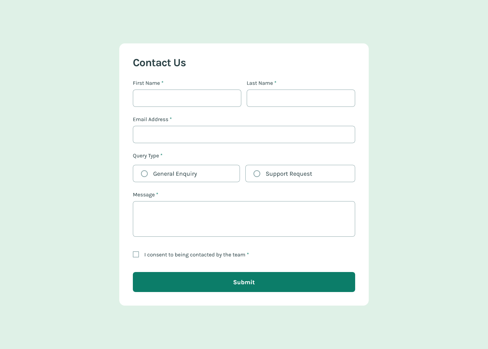

# Frontend Mentor - Contact form solution

This is a solution to the [Contact form challenge on Frontend Mentor](https://www.frontendmentor.io/challenges/contact-form--G-hYlqKJj). Frontend Mentor challenges help you improve your coding skills by building realistic projects. 

## Table of contents

- [Overview](#overview)
  - [The challenge](#the-challenge)
  - [Screenshot](#screenshot)
  - [Links](#links)
- [My process](#my-process)
  - [Built with](#built-with)
  - [What I learned](#what-i-learned)
  - [Continued development](#continued-development)
  - [Useful resources](#useful-resources)
- [Author](#author)

## Overview

### The challenge

Users should be able to:

- Complete the form and see a success toast message upon successful submission
- Receive form validation messages if:
  - A required field has been missed
  - The email address is not formatted correctly
- Complete the form only using their keyboard
- Have inputs, error messages, and the success message announced on their screen reader
- View the optimal layout for the interface depending on their device's screen size
- See hover and focus states for all interactive elements on the page

### Screenshot

### Links

- [Solution URL](https://github.com/loki-pepe/contact-form)
- [Live Site URL](https://loki-pepe.github.io/contact-form/)

## My process

### Built with

- Semantic HTML5 markup
- CSS custom properties
- Flexbox
- Mobile-first workflow

### What I learned

I have learned the basics of using ARIA attributes to improve form accessibility, most notably to cater to screen readers. Specifically, I have used the following attributes:
- `aria-hidden` to hide visual content from screen readers
- `aria-live` to denote elements whose content change should be announced by screen readers
- `aria-invalid` to denote an invalid input
- `aria-describedby` to create connections between invalid inputs and the corresponding error messages.

### Continued development

I plan on focusing further on learning about accessibility tools, as I firmly believe the web should be accessible to all. Next time, I will perhaps omit the native `required` attribute and handle form validation solely using custom code.

### Useful resources

- [MDN Web Docs](https://developer.mozilla.org/) - An extensive resource on everything HTML and CSS.
- [Stack Overflow](https://stackoverflow.com/) - Community answers to specific questions.
- [CSS Clamp Generator](https://css-clamp-generator.com/) - A helpful calculator for using the CSS `clamp()` function.

## Author

- GitHub - [Lovro Peraić](https://github.com/loki-pepe)
- Frontend Mentor - [@loki-pepe](https://www.frontendmentor.io/profile/loki-pepe)
